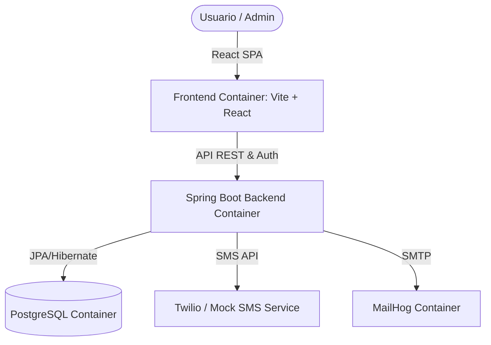

# 📋 LogiTrack ERP - Especificaciones y Arquitectura de Futura Implementación

Este documento sirve como el plano técnico y la especificación de referencia para las nuevas funcionalidades y la evolución de **LogiTrack ERP**. Define los flujos de negocio, el modelo de datos, la seguridad y la infraestructura dockerizada.

---

## 🏗️ 1. Arquitectura y Stack Tecnológico

El sistema mantendrá su división desacoplada pero ahora bajo una infraestructura completamente contenerizada:

### Componentes de la Infraestructura (Dockerizada)
1. **`frontend-service`**: Servidor Nginx que sirve los estáticos optimizados de la build de producción de Vite/React.
2. **`backend-service`**: Aplicación Java 25 + Spring Boot que expone las APIs REST y ejecuta tareas automatizadas en segundo plano.
3. **`db-service`**: Base de datos relacional PostgreSQL para persistencia de datos.
4. **`mailhog-service`**: Servidor SMTP simulado para recibir y visualizar correos electrónicos salientes en desarrollo.

---

## 🔒 2. Autenticación y Recuperación de Contraseña (SMS / Email)

Además de la autenticación por contraseña y SMS OTP (2FA) durante el inicio de sesión, el sistema integrará un flujo automatizado para la **Recuperación de Contraseña**:
1. **Solicitud de recuperación:** El usuario introduce su email en la vista de recuperar contraseña.
2. **Desafío:** El backend genera un token de un solo uso y lo envía de forma automática:
   * Por **SMS** al teléfono móvil registrado.
   * Por **Correo electrónico** al buzón del usuario (a través del servidor de correo).
3. **Restablecimiento:** El usuario introduce el código recibido junto con su nueva contraseña para actualizar su perfil de forma segura.

---

## 👥 3. Control de Acceso Basado en Roles (RBAC)

Se definen tres roles para ampliar la granularidad del sistema:

| Rol | Permisos en Inventario | Funciones de Automatización |
| :--- | :--- | :--- |
| **`USER`** | Crear, editar y eliminar sus **propios** productos. | Exportación básica de sus datos a CSV. |
| **`TECNICO`** | Modificar niveles de stock y realizar inventariado físico. | Recibe alertas de reposición críticas. |
| **`ADMIN`** | Gestionar todos los productos del sistema, controlar stock global. | Recibe informes automáticos en PDF por correo, visualiza Logs de Auditoría totales. |

---

## 📊 4. Automatización y Reportes (CSV / PDF / Email)

El núcleo diferencial del ERP será su motor de automatización:

### A. Exportación Bajo Demanda (CSV / PDF):
* **Exportación CSV:** Generación instantánea de archivos planos delimitados por comas desde la tabla de productos para que los usuarios puedan abrirlos directamente en Excel.
* **Reporte de Inventario en PDF:** Creación de documentos estructurados en PDF con tablas estilizadas y un balance del valor monetario total del inventario.

### B. Tareas Programadas de Stock (`Spring Boot @Scheduled`):
* Un servicio en segundo plano revisará periódicamente (por ejemplo, diariamente o al presionar un botón de control) el inventario.
* Si detecta productos con stock por debajo de su límite de alerta (`minStockAlert`), generará automáticamente un informe en formato **PDF** y enviará una **notificación por correo electrónico** a los administradores y técnicos utilizando MailHog para avisar de la necesidad de reposición.

---

## 📦 5. Registro de Auditoría y Notificación de Logs

* **Logs Críticos:** Cada operación crítica (inicio de sesión, cambio de rol, creación de producto, edición de stock, eliminación) se registra en `AuditLog`.
* **Notificaciones de logs en tiempo real:** Los eventos críticos del sistema pueden configurar reglas para enviar una alerta inmediata por correo al rol técnico o administrador correspondiente si ocurre una anomalía (ej. caída brusca de stock).
